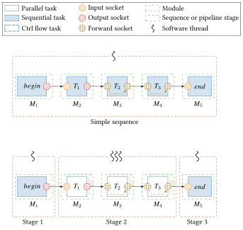

# AFF3CT-core

`AFF3CT-core` is a **Domain Specific Embedded Language** (DSEL) for **streaming 
applications**. It comes in the form of a standard, compiled C++11 library to link 
with.

Here are the main features of `AFF3CT-core`:
  - Definition of **modules**, **tasks** and **sockets**
    * "Stateless and stateful" model **driven by a graph of tasks** where the 
      edges are the **data dependencies** (dataflow)
  - Elementary modules and tasks implementations
  - **Multi-threaded runtime** with **replication** and **pipeline** parallel 
    constructs

This project is used as the multi-threaded runtime engine of
[AFF3CT](https://github.com/aff3ct/aff3ct): a simulator for channel coding and a
library for real time Software-Defined Radio (SDR) systems.
As the core of AFF3CT was no longer specific, it has been extracted from it: 
`AFF3CT-core` was born!

This DSEL/library is suitable for SDR systems, audio/video processing and more 
generally it matches single-rate Synchronous DataFlow (SDF) streaming 
applications.

## Documentation

Two documentations are available:
- [For users](https://largo.lip6.fr/~cassagnea/docs/UFR/MU5IN160/CM/CM5_AFF3CT_for_Streaming_Apps.pdf): 
  Slides used to teach `AFF3CT-core` to Master students in Computer Science at 
  [Sorbonne University](https://www.sorbonne-universite.fr/). It contains many 
  illustrative and simple use cases. **It is the good document to start with 
  `AFF3CT-core`**.
- [For developers](https://aff3ct.github.io/aff3ct-core/): Website that explains 
  how `AFF3CT-core` is built and works. This documentation is particularly 
  **useful for modifying and contributing to `AFF3CT-core`**.

## License

The project is licensed under the MIT license.

## How to cite AFF3CT-core

The main contributions of this work are described in the following journal 
article:  
- A. Cassagne, R. Tajan, O. Aumage, D. Barthou, C. Leroux and C. Jégo,  
  “**A DSEL for High Throughput and Low Latency Software-Defined Radio on Multicore CPUs**,“  
  *Wiley Concurrency and Computation: Practice and Experience (CCPE)*, 2023.  
  [[Open access article](https://doi.org/10.1002/cpe.7820)] [[Bibtex entry](https://aff3ct.github.io/resources/bibtex/Cassagne2023%20-%20A%20DSEL%20for%20High%20Throughput%20and%20Low%20Latency%20Software-Defined%20Radio%20on%20Multicore%20CPUs.bib)]

*To thank us even more*, we encourage you to also cite the original AFF3CT 
journal article to give more visibility to our work:  
- A. Cassagne, O. Hartmann, M. Léonardon, K. He, C. Leroux, R. Tajan, O. Aumage, D. Barthou, T. Tonnellier, V. Pignoly, B. Le Gal and C. Jégo,  
  “**AFF3CT: A Fast Forward Error Correction Toolbox!**,“  
  *Elsevier SoftwareX*, 2019.  
  [[Open access article](https://doi.org/10.1016/j.softx.2019.100345)] [[Bibtex entry](https://aff3ct.github.io/resources/bibtex/Cassagne2019a%20-%20AFF3CT:%20A%20Fast%20Forward%20Error%20Correction%20Toolbox.bib)]
