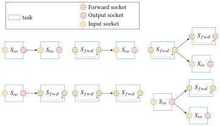
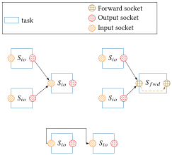

# Socket

Sockets are used to communicate data between [tasks](1_module_task.md). There
are 3 different types of sockets:

- `Socket_IN`: read input data.
- `Socket_OUT`: write output data.
- `Socket_Forward`: a combination of in and out sockets, reading and writing
                    data. (See [Forward socket](6_socket_fwd.md))

A task can have either `input & output` sockets or a `forward` socket, or both
(more than one).


## Attributes

```cpp
socket_t type;
```
Define the socket type `IN`, `OUT` or `FWD`.

```cpp
std::string name;
```
Custom name for the socket.

```cpp
std::type_index datatype;
```
The type of data exchanged.

```cpp
void* dataptr;
```
Pointer to the data of the socket (memory space).

```cpp
std::vector<Socket*> bound_sockets;
```
The `input` or `forward` sockets bound to the current socket. Only relevant for
`output` or `forward` sockets.

```cpp
Socket* bound_socket;
```
The unique `output` or `forward` socket bound to the current socket. Only
relevant for `input` or `forward` sockets.

## Methods

The most important methods of the socket class are the bind and unbind
functions.

```cpp
void bind(Socket &s_out, const int priority = -1);
```
This function is used to connect sockets with each other, it can be called by an
`input` or `forward` socket and takes as parameter an output or forward socket.
The function gets the caller's `dataptr` and redirects it to `s_out dataptr`.

!!! danger
    Binding rules must be respected.
=== "Valid bindings"
    
=== "Invalid bindings"
    

```cpp
void  unbind(Socket  &s_out, const  int  priority = -1);
```
This function is used to disconnect sockets from each other, the `s_out` must be
bound to the caller socket.

## When to use forward

We have to pay attention during the choice of the socket type for our task,
using a `SIO` or `SFWD` is very important for the application data coherency and
performance. 

The most important point is the `dataptr` attribute, it's the pointer to the
memory space where the data used by the task is stored.
 
- In the case of the `SIO`, the input and the output sockets have their own
  `dataptr`. The `input` socket receives the pointer from its bound socket and
  the `output` has its own allocated memory space, the data received and
  computed by the task are written to the `output` memory space. The initial
  data are not modified in this case, there are no *side effects*.
- In the case of the `SFWD`, the forward socket receives its `dataptr` from the
  bound socket like an `input`. But unlike the `SIO` case, the computed data are
  written directly on the provided memory space, thus overwriting it (and
  potentially losing important information), there are *side effects*.
