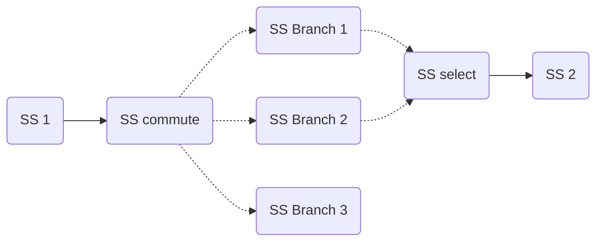

## Introduction

`AFF3CT-core` allows the user to control the execution flow of sequences through the use of [switcher](Switcher.md), however sequences are often used within the context of [pipelines](Pipeline & Adaptor.md) and thus some slight adjustements to behaviour were required for them to consistently work.

## Technical improvement

### Finding the last subsequence

Upon creation a pipeline must add pull and push tasks at the beginning the end of the sequences making up its stages (see [pipeline](Pipeline & Adaptor.md) and [sequence](Sequence & Subsequence.md) for the relationship between the two).  
For that purpose a depth-first search algorithm is used to traverse the digraph starting from the root of the sequence, marking every node on the path and returning the last node it passed through.  
This however can return incorrect nodes depending on the configuration of the sequence.  

Pseudo-code
```
Node Last_Subseq(Node n):
    mark(n)
    Node last_node = n
    for every child c of n that is not marked:
        last_node = Last_Subseq(c)
    return last_node
```
#### Depth-first search for the last subsequence

=== "Switch"
    ```mermaid
        graph LR;
        A(SS 1)-->B(SS commute);
        B(SS commute)-.->C(SS Branch 1);
        B(SS commute)-.->D(SS Branch 2);
        B(SS commute)-.->E(SS Branch 3);
        C(SS Branch 1)-.->F(SS select);
        D(SS Branch 2)-.->F(SS select);
        E(SS Branch 3)-.->F(SS select);
        F(SS select)-->G(SS 2);
    ```
    Here are the paths the DFS would take are  
    - [SS 1, SS commute, SS Branch 1, SS select, SS 2] : returns SS 2  
    - [SS 1, SS commute, SS Branch 2] : returns SS Branch 2  
    - [SS 1, SS commute, SS Branch 3] : returns SS Branch 3  
    As the function is recursive, it returns the result of the last path taken : SS Branch 3, which is *incorrect*, SS 2 is the expected result.
=== "Loop"
    ```mermaid
    graph LR;
    A(SS 1)-.->B(SS select);
    B(SS select)-->C(SS 2);
    C(SS 2)-->F(SS commute);
    F(SS commute)-.->E(SS 3);
    E(SS 3)-.->B(SS select);
    F(SS commute)-.->G(SS 4);
    ```
    Here are the paths the DFS would take are  
    - [SS 1, SS select, SS 2, SS commute, SS 3] : returns SS 3  
    - [SS 1, SS select, SS 2, SS commute, SS 4] : returns SS 4  
    As the function is recursive, it returns the result of the last path taken : SS Branch 3, which is *correct*.
=== "Switch in a loop"
    ```mermaid
    graph LR;
    A(SS 1)-.->B(SS select 1);
    B(SS select 1)-->C(SS 2);
    C(SS 2)-->F(SS commute 1);
    F(SS commute 1)-..->G(SS commute 2);
    G(SS commute 2)-.->H(SS Branch 1);
    F(SS commute 1)-.->M(SS 4);
    G(SS commute 2)-.->J(SS Branch 2);
    G(SS commute 2)-.->K(SS Branch 3);
    H(SS Branch 1)-.->L(SS select 2);
    J(SS Branch 2)-.->L(SS select 2);
    K(SS Branch 3)-.->L(SS select 2);
    L(SS select 2)-->B(SS select 1);
    ```
    Here are the paths the DFS would take  
    - [SS 1, SS select 1, SS 2, SS commute 1, SS 4] : returns SS 4  
    - [SS 1, SS select 1, SS 2, SS commute 1, SS select commute 2, SS Branch 1, SS select 2] : returns SS select 2  
    - [SS 1, SS select 1, SS 2, SS commute 1, SS select commute 2, SS Branch 2] : returns SS Branch 2  
    - [SS 1, SS select 1, SS 2, SS commute 1, SS select commute 2, SS Branch 3] : returns SS Branch 3  
    As the function is recursive, it returns the result of the last path taken : SS Branch 3, which is *incorrect*, SS 4 is the expected result.
=== "No switcher"
    ```mermaid
    graph LR;
    A(SS 1);
    ```
    As explained in [Sequence & Subsequence](Sequence & Subsequence.md), a sequence with no [switcher](Switcher.md) would only have a single 
    subsequence, thus the DFS would return **SS 1** as the last subsequence which is *correct*.

The solution would be to consider the node *without* children as the last one. Thus an improved DFS would be :  
```
Node Last_Subseq(Node n):
    mark(n)
    if n is childless:
        return n
    else
        Node last_node = null
        for every child c of n that is not marked:
            Node branch_result = Last_Subseq(c)
            if branch_result != null:
                last_node = branch_result
        return last_node
```
### Finding invalid switchers

Another use  of the DFS algorithm would be to notify the user of improper uses of switchers. Commutes and Selects must always have paths linking each other, we find broken paths by traversing the subsequences with a modified DFS. Since the DFS already records parsed nodes we can use this information to tell if a commute or select is invalid.

#### Depth-first search for invalid switchers
The following subsequences denotes an invalid binding.  

This subsequence is invalid because the last branch has no path to the select.
Here are the paths the DFS would take  
- [SS 1, SS commute, SS Branch 1, SS select, SS 2] : No problem, the list contains both commute and select  
- [SS 1, SS commute, SS Branch 2, SS select, SS 2] : Ditto  
- [SS 1, SS commute, SS Branch 1]                  : Invalid, this path only contains a commute. We notify the user regarding the broken commute