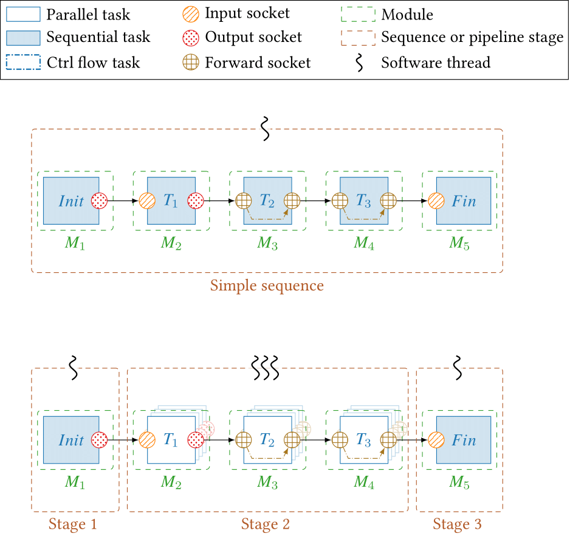

## Pipeline

  

Pipeline is a mechanism offered by `AFF3CT-core` to execute a [Sequence](Sequence.md), by dividing it into multiple stages and execute each stage on one or multiple threads.

  



  

### Attributes

```cpp 
Sequence original_sequence
``` 
 The original sequence from which the pipeline is created.

  
```cpp 
std::vector<std::shared_ptr<Sequence>> stages 
``` 
 Vector of the different stages (each stage is a sequence) of the pipeline.

  

```cpp
std::vector<std::pair<std::tuple<runtime::Socket*, size_t, size_t, size_t,size_t>,
			std::tuple<runtime::Socket*, size_t, size_t, size_t>>> sck_orphan_binds :
```
Vector of sockets with broken connections due to pipeline stage creation, these sockets will be bound later to special modules called [Adaptors](#Adaptors), to connect the different stages.
```cpp
std::vector<std::tuple<runtime::Socket*, runtime::Socket*, size_t>> adaptors_binds
```
Vector of tuple (input, output, priority) for the created adaptors, priority is used to order the tuples.
### Methods

```cpp

void  init(const  std::vector<TA*> &firsts,
		   const  std::vector<TA*> &lasts,
		   const  std::vector<std::tuple<std::vector<TA*>, std::vector<TA*>, std::vector<TA*>>> &sep_stages = {},
		   const  std::vector<size_t> &n_threads = {},
		   const  std::vector<size_t> &synchro_buffer_sizes = {},
		   const  std::vector<bool> &synchro_active_waiting = {},
		   const  std::vector<bool> &thread_pinning = {},
           const  std::vector<std::vector<size_t>> &puids = {} 
          );
```

This function builds the pipeline given :

  

- The first task of the original sequence.

- The firsts and lasts tasks of each stage.

- The number of threads to execute on each stage.

- The number of buffers between stages.

- The type of waiting for the adaptor tasks. 

  

```cpp
void  create_adaptors(const  std::vector<size_t> &synchro_buffer_sizes = {},
const  std::vector<bool> &synchro_active_waiting = {});
```
This function creates the adaptor tasks that are added between every stage to transmit data from the stage $S$ to stage $S+1$. AFF3CT doesn't support two multithreaded stages following each other.

```cpp
void  _bind_adaptors(const  bool  bind_adaptors = true);
```

Adaptor module tasks need to be bound to each task in the two consecutive stages, the target sockets to bind are stored in the vector`sck_orphan_binds.`
## Adaptor

  

Adaptors are special modules added by the application when creating a pipeline. As said before, the adaptors are bound to edge tasks between each two consecutive stages. The purpose of adaptors is to synchronize data exchange between each stage using preallocated buffer pools. We have 4 tasks performed by adaptor :

  

- push_1 : when the $S$ stage is executed on one thread and the $(S+1)$ stage is on multiple threads, the function gets an empty buffer and fills it with the data produced in the stage $S$. The buffers are filled using a round-robin algorithm.

- pull_n : when the $S$ stage is executed on multiple threads and the $(S-1)$ stage is on one thread, it's the task that faces the `push_1`, it takes a filled buffer from the interstage pool and forward the data. There is a `pull_n` task for every thread of the stage.

- push_n : when the $S$ stage is executed on multiple threads and the $(S+1)$ stage is on one thread, the task takes an empty buffer from the pool and fills it with the data produced by the thread. There is a `push_n` task for each thread of the stage.

- pull_1 : when the $S$ stage is executed on one thread and the $(S-1)$ stage is on multiple threads, it's the task that faces the `push_n`. It takes filled buffers from the pool using the same round-robin algorithm as `push_1` and forward the data.


### Attributes
```cpp
const  size_t buffer_size
```
The interstage buffer pool size.
```cpp
std::shared_ptr<std::vector<std::vector<std::vector<int8_t*>>>> buffer
```
 Pointers to each buffer`of the interstage pool.

``` cpp
std::shared_ptr<std::vector<std::atomic<uint64_t>>> first;

std::shared_ptr<std::vector<std::atomic<uint64_t>>> last;
```
Two pointers used to monitor the buffer pool, `first` is used to get the filled buffers, and `last` for the empty ones.


### Methods

These are the methods used to synchronize the buffer pool between the pipeline stages.  When getting a buffer, the thread may sleep.
```cpp
virtual  void*  get_empty_buffer(const  size_t  sid) =  0; 
```
Get a pointer to the first empty buffer in the pool (at index last).
```cpp
virtual  void*  get_filled_buffer(const  size_t  sid) =  0;
```
Get a pointer to the first filled buffer in the pool (at index first).

```cpp
virtual  void*  get_empty_buffer(const  size_t  sid, void*  swap_buffer) =  0;
```
Get a pointer to the first empty  buffer in the pool, and replace that buffer with a new one pointed by `swap_bufer `. 

```cpp
virtual  void*  get_filled_buffer(const  size_t  sid, void*  swap_buffer) =  0;
```
Get a pointer to the first filled  buffer in the pool, and replace that buffer with a new one pointed by `swap_bufer `.

```cpp
virtual  void  wake_up_pusher() =  0;
```
The puller can wake up a push task if this one is waiting for an empty buffer.

```cpp
virtual  void  wake_up_puller() =  0;
```
The pusher can wake up a pull task if this one is waiting for an empty buffer.
