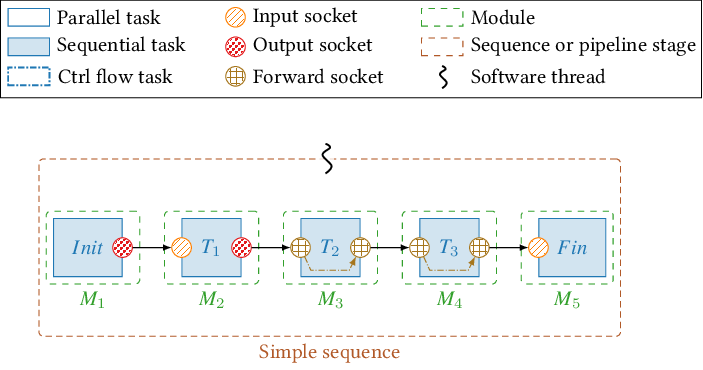

# Sequence


Sequence is  a set of task bounded following a specific order of execution. 



Before going through sequence attributes and methods, you have to read about the  [sub-sequences](Sub-sequence.md).

## Attributes 
```cpp 
size_t  n_threads;
``` 
- Thread number executing the sequence.

```cpp
std::vector<tools::Digraph_node<Sub_sequence>*>  sequences;
```
Vector of sub-sequences of the main sequence.

```cpp
std::vector<size_t>  firsts_tasks_id;
std::vector<size_t>  lasts_tasks_id;
std::vector<std::vector<runtime::Task*>>  firsts_tasks;
std::vector<std::vector<runtime::Task*>>  lasts_tasks;
```
Vectors used to get the firsts and lasts tasks of the sequence. The first tasks are the ones without parents, and  the last are the ones without children in the constructed sub-sequences graph. 

```cpp
std::vector<std::vector<module::Module*>>  all_modules;
```
Vector of modules contained within the sequence. 


##  Methods

```cpp
void  gen_processes(const  bool  no_copy_mode  =  false);
```
This function is the most important of the sequence class, its main purpose is to browse the sub-sequence graph and perform some operations modifying the original sequence bind and the function of some tasks to add some features to the original execution for more performance or coherence. Before reading the modifications applied by the function, you have to see for  [Adaptor](Pipeline.md) and [Switcher](Text.md).

 - `push_task & pull_task` : as we explained in the adaptor part, the tasks change their `dataptr` when they get the new buffers from the interstage pool, the new pointer needs to be updated for each socket bound to the old one. `gen_processes` performs the update every time it finds a `pull or push task`.
 - `commute_task & select_task` : ?
 - `Other tasks` : Original execution.

```cpp
void explore_thread_rec(Socket* socket, std::vector<runtime::Socket*>& liste_fwd);
```
The function called by `gen_processes` to get all the bound sockets (children) to the modified one, this call is performed once at sequence build.

```cpp
void explore_thread_rec_reverse(Socket* socket, std::vector<runtime::Socket*>& liste_fwd)
```
The function does the same thing as the previous one, but in the other sense (parents). This function is introduced to support `forward socket` runtime rebinding, because all the tasks share the same `dataptr`.


