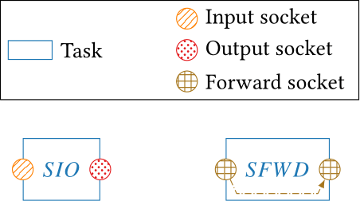
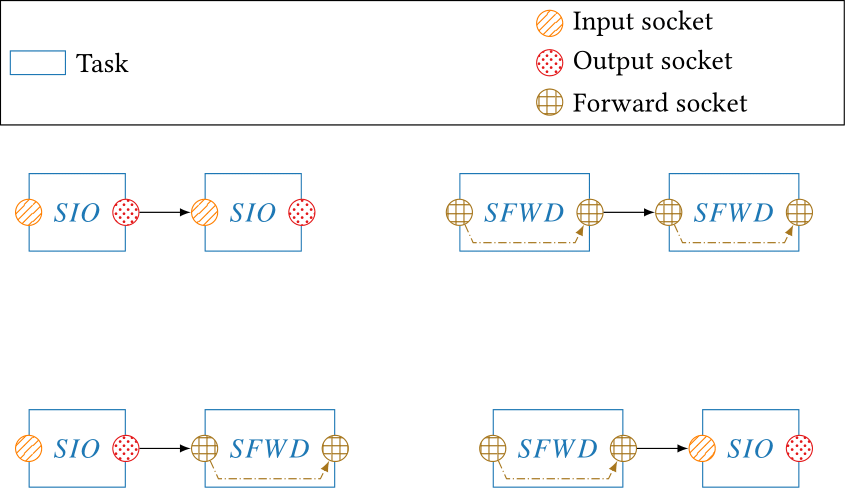
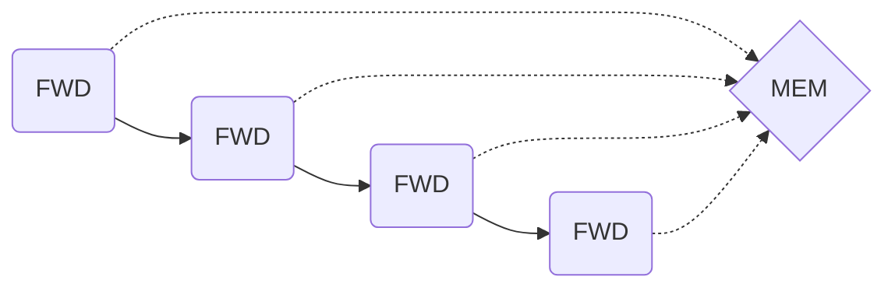

  

## Socket

Sockets are used to communicate data between [tasks](module & task.md). There are 3 different types of sockets :

- `Socket_IN` : Getting input data.

- `Socket_OUT` : Send output data.

- `Socket_Forward` : Both In and Out socket, it gets input data and transmits output.

A task can have either `input & output` sockets or `forward` socket.




### Attributes

```cpp
socket_t type;
```

Used for to define the type of the socket.
```cpp
std::string name;
```

Custom name for socket.
```cpp
std::type_index datatype
```
Type of data exchanged.
```cpp
void* dataptr
```
Pointer to the data of the socket.
```cpp
std::vector<Socket*> bound_sockets;
```
It saves the `input or forward` bound sockets to the current `output or forward` socket. This vector is empty for the input socket.
```cpp
Socket* bound_socket;
```
It saves the `output or forward` unique bound socket to the current `input or forward` socket. This pointer is empty for the output socket.

### Methods
The most important methods of the socket class are the bind and unbind functions.

```cpp
void  bind(Socket  &s_out, const  int  priority = -1)
```
This function is used to connect sockets with each other, it can be called by an input or forward socket and take as parameter an output or forward socket. The function get caller `dataptr` and make it point to `s_out dataptr`. The sockets can be bound this way :



```cpp
void  unbind(Socket  &s_out, const  int  priority = -1);
```
This function is used to disconnect sockets with each other, the `s_out` must be bound to the caller socket.

### Using Forward or Input/Output sockets
We have to pay attention during the choice of the socket type for our task, using a `SIO (Input/Output)` or `SFWD(Forward)` is very important for the application data coherency and performance. 
#### The differences to know about the sockets

 The most important point is the `dataptr attribute`, it's the pointer to the memory space where the data used by the task is stored. 
 
 - In the case of the `SIO`, the input and the output sockets have their own `dataptr`. The input socket receives the pointer from its bound socket and the output has its own allocated memory space, the data received and computed by the task are written to the output memory space. The initial data are not modified in this case.
 
 - In the case of the `SFWD`, the forward socket receives its `dataptr` from the bound socket like the input. But unlike the `SIO` case, the computed data are overwritten on the given memory space, so that the initial data are modified and lost. All the tasks with `SFWD` consecutively bound to each other share the same memory space.




