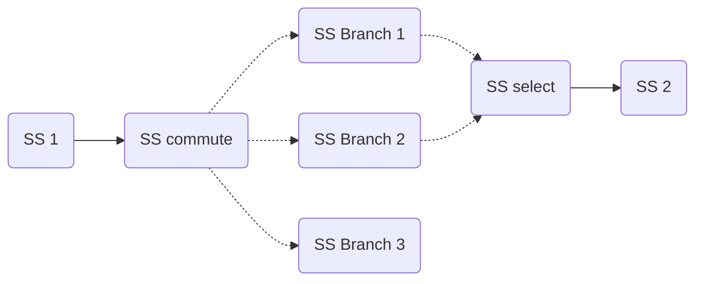

# Pipeline & Control Flow

## Introduction

`AFF3CT-core` allows the user to control the execution flow of sequences through
the use of [switcher](switcher.md), however sequences are often used within the
context of [pipelines](pipeline.md) and thus some slight behavior adjustments 
were required for them to work consistently.

## Technical Improvements

### Finding the Last Sub-sequence

Upon creation, a pipeline must add `pull` and `push` tasks at the beginning and 
the end of the sequences making up its stages (see [pipeline](pipeline.md) 
section and [sequence](sequence.md) section for the relationship between the 
two). For that purpose, a DFS algorithm is used to traverse the 
[directed graph](sequence.md#Digraph) starting from the root of the sequence, 
marking every node on the path and returning the last node it passed through. 
This however can return incorrect nodes depending on the configuration of the 
sequence.

Pseudo-code
```
Node Last_Subseq(Node n):
    mark(n)
    Node last_node = n
    for every child c of n that is not marked:
        last_node = Last_Subseq(c)
    return last_node
```

#### DFS for the Last Sub-sequence

=== "Switch"
    ```mermaid
        graph LR;
        A(SS 1)-->B(SS commute);
        B(SS commute)-.->C(SS Branch 1);
        B(SS commute)-.->D(SS Branch 2);
        B(SS commute)-.->E(SS Branch 3);
        C(SS Branch 1)-.->F(SS select);
        D(SS Branch 2)-.->F(SS select);
        E(SS Branch 3)-.->F(SS select);
        F(SS select)-->G(SS 2);
    ```  
    Here are the paths the DFS would take are

    - [`SS 1`, `SS commute`, `SS Branch 1`, `SS select`, `SS 2`] : returns `SS 2`
    - [`SS 1`, `SS commute`, `SS Branch 2`] : returns `SS Branch 2`
    - [`SS 1`, `SS commute`, `SS Branch 3`] : returns `SS Branch 3`

    As the function is recursive, it returns the result of the last path taken:
    `SS Branch 3`, which is *incorrect*, `SS 2` is the expected result.

=== "Loop"
    ```mermaid
    graph LR;
    A(SS 1)-.->B(SS select);
    B(SS select)-->C(SS 2);
    C(SS 2)-->F(SS commute);
    F(SS commute)-.->E(SS 3);
    E(SS 3)-.->B(SS select);
    F(SS commute)-.->G(SS 4);
    ```  
    Here are the paths the DFS would take are

    - [`SS 1`, `SS select`, `SS 2`, `SS commute`, `SS 3`] : returns `SS 3`
    - [`SS 1`, `SS select`, `SS 2`, `SS commute`, `SS 4`] : returns `SS 4`

    As the function is recursive, it returns the result of the last path taken:
    `SS 4`, which is *correct*, **but deceptive**. It only happened to work
    because of the order in which the children of node `SS commute` were parsed.
    If `SS 4` had been parsed first, then it would have returned `SS 3`. This kind of
    behavior is problematic as the algorithm should not depend on which
    children is first in a list, as that is not relevant to the layout of the
    graph.

=== "No switcher"
    ```mermaid
    graph LR;
    A(SS 1);
    ```  
    As explained in the [sequence](sequence.md) section, a sequence with no 
    [switcher](switcher.md) would only have a single sub-sequence, thus the DFS 
    would return `SS 1` as the last sub-sequence which is *correct*.

----

#### Improved DFS

The solution is to consider the node *without* children as the last one.
```python
Node Last_Subseq(Node n):
    mark(n)
    if n is childless:
        return n
    else
        Node last_node = null
        for every child c of n that is not marked:
            Node branch_result = Last_Subseq(c)
            if branch_result != null:
                last_node = branch_result
        return last_node
```

This is simple and efficient.

!!! info
    This is the current implementation in `AFF3CT-core`.

### Finding Invalid Switchers

Another use of the DFS algorithm is to notify the user of improper uses of 
switchers. `commute` and `select` tasks must always have paths linking each 
other. We find broken paths by traversing the sub-sequences with a modified DFS. 
Since the DFS already records parsed nodes we can use this information to tell 
if a `commute` or `select` task is orphan (and thus, *invalid*).

#### Depth-first Search for Invalid Switchers

The following sub-sequences denotes an invalid binding.



This sub-sequence is invalid because the last `SS Branch 3` has no path to the 
`select` task. Here are the paths the DFS would take:

- [`SS 1`, `SS commute`, `SS Branch 1`, `SS select`, `SS 2`] : No problem, the 
  list contains both commute and select
- [`SS 1`, `SS commute`, `SS Branch 2`, `SS select`, `SS 2`] : Ditto
- [`SS 1`, `SS commute`, `SS Branch 3`] : Invalid, this path only contains a 
  `commute`. We notify the user regarding the broken `commute`.

```python
# Note that path_taken here is copied between recursive calls and NOT shared
void Check_ctrl_flow(Node n, List path_taken):
    if n is not in path_taken and n is not childless
        path_taken.append(n)
        for every child c of n:
            Check_ctrl_flow(c, path_taken)
    else
        for i = 0, i < path_taken.size, i++:
            if path_taken[i] does not contain a switcher task:
                continue:
            Task first_task  = path_taken[i] #We found the first task
            for j = i, j < path_taken.size, j++:
                # We found the second task
                if path_taken[j] is the opposite switcher task of path_taken[i]: 
                    break:
            # We went through the entire path and didn't find the other switcher 
            # task
            if j == path_taken.size 
                throw an error
```

### Tests

Some specific tests have been added to the project to validate the robustness of 
the control flow inside a pipeline stage.

=== "Switch-case inside a parallel stage"
    <figure markdown>
      { width="950" }
      <figcaption>`test-exclusive-paths-pipeline`.</figcaption>
    </figure>
    ```bash
    test-exclusive-paths-pipeline -t 4 -i ../CMakeLists.txt
    ```  
    In this test, the read bytes (from the source $t_1$) are alternatively 
    converted to upper case and to lower case (see $t_5$ and $t_6$ task). As 
    explained in the [Work in Progress](./wip.md#End-of-sequence) section, we 
    need to add a `relay` task ($t_8$) after the `select` task ($t_7$) to
    make it work.

=== "Nested loops inside a parallel stage"
    <figure markdown>
      { width="1200" }
      <figcaption>`test-nested-loops-pipeline`.</figcaption>
    </figure>
    ```bash
    test-nested-loops-pipeline -i 20 -j 50 -t 8
    ```
    In this test, two nested loops inside a parallel stage are tested.
    `-i` sets the number of iterations in the outer loop ($t_4$ Iterator) and 
    `-j` sets the number of iterations in the inner loop ($t_7$ Iterator).
    As explained in the [Work in Progress](./wip.md#End-of-sequence) section, we 
    need to add `relay` tasks ($t_2$ and $t_{15}$) before the first `select` 
    task ($t_3$) and after the last `commute` task ($t_5$) to make it work.
