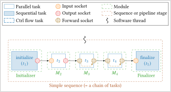

<a name="Sequence"></a>
# Sequence

A **sequence** is a set of bound [tasks](task.md). It represents the graph to 
execute for each new frame (= new stream). When a sequence is built, the tasks 
execution order is fixed. Thus, for each frame, the graph is executed following 
a fixed "sequence" of tasks.

<figure markdown>
  { width="600" }
  <figcaption>Example of a simple sequence of tasks (single threaded).</figcaption>
</figure>

A sequence is a C++ object of the `spu::runtime::Sequence` class. The 
following sections try to give an overview of the most important attributes and 
methods to facilitate the code understanding.

## Main Attributes 

```cpp 
size_t n_threads;
``` 
The number of threads that are executing the sequence.

```cpp
std::vector<tools::Digraph_node<runtime::Sub_sequence>*> sequences;
```
Vector of [sub-sequences](#Sub-sequence) of the main sequence (one per thread).

```cpp
std::vector<size_t>                      firsts_tasks_id;
std::vector<size_t>                      lasts_tasks_id;
std::vector<std::vector<runtime::Task*>> firsts_tasks;
std::vector<std::vector<runtime::Task*>> lasts_tasks;
```
Vectors used to get the firsts and lasts tasks of the sequence. The first tasks
are the ones without parents, and  the last are the ones without children in the
constructed [directed graph](#Digraph).

```cpp
std::vector<std::vector<module::Module*>> all_modules;
```
Vector of [modules](module.md) contained within the sequence.

## Main Methods

```cpp
void exec();
```
This is the public method that runs the sequence in loop. Other variants exist
where it is possible to give a stop condition function.

```cpp
void gen_processes(const bool no_copy_mode = false);
```
This function is one of the most important of the sequence class, it is called
by the `Sequence` constructor. Its main purpose is to parse the sub-sequence 
graph and to perform some operations that can modify the user bindings. 
Additionally, some tasks can be optimized and/or interpreted as a DSEL keyword. 

!!! warning
    Before reading the following paragraph you should be familiar with the 
    [Adaptor](pipeline.md#Adaptor) and [Switcher](switcher.md) modules.

Here is a list of the transformations that are performed during the 
`gen_processes` method:

 - `push` & `pull` tasks (from `Adaptor` module): as explained in the 
   [adaptor's](pipeline.md#Adaptor) section, tasks change their `dataptr` when 
   they get the new buffers from the inter-stage pool, the new pointer needs to 
   be updated for each socket bound to the old one. This behavior is added 
   through a `process` (nothing to do with OS processes) that encapsulates `push` 
   and `pull` tasks. This `process` is triggered each time there is a `pull` or
   `push` task execution in the sequence.
 - `commute` & `select` tasks (from `Switcher` module): these two tasks are used 
   to select which path to flow for the execution, when a path is selected the 
   bound sockets need to update their `dataptr` to follow the right one. Same 
   as before, a dedicated `process` is created and triggered.
 - Other tasks: a dumb `process` will be created for each task and it will only 
   call its corresponding task.

<a name="Explore_thread_rec"></a>
```cpp
void explore_thread_rec(Socket* socket, std::vector<runtime::Socket*>& list_fwd);
```
The function is called by `gen_processes` to get all the bound sockets (next) of
the modified one, if the encountered socket is of type `forward` the function is
called recursively on this new socket (see the
[Forward socket and pipeline](socket_fwd.md) section). This call is performed 
once at sequence build.

!!! warning
    This function is no longer a method of the `runtime::Sequence` class, it is 
    now integrated as an anonymous (= lambda) function in the `gen_processes` 
    method. This is because `explore_thread_rec` is only used in 
    `gen_processes`.

<a name="Explore_thread_rec_reverse"></a>
```cpp
void explore_thread_rec_reverse(runtime::Socket* socket, std::vector<runtime::Socket*>& list_fwd);
```
The function does the same thing as the previous one, but in the other sense
(previous).

!!! warning
    This function is no longer a method of the `runtime::Sequence` class, it is 
    now integrated as an anonymous (= lambda) function in the `gen_processes` 
    method. This is because `explore_thread_rec_reverse` is only used in 
    `gen_processes`.

<a name="Sub-sequence"></a>
## Sub-sequence

When [control flow tasks](switcher.md) are introduced into a sequence, the
execution is not only defined by the tasks binding but also by their output 
sockets. For this purpose, tasks are grouped into sub-sequences. Sub-sequences 
are organized in a [directed graph](#Digraph) with two nodes designated as begin 
and end, respectively. This graph is recursively built during a sequence 
initialization from the first task and going from bound `output`/`forward` 
socket to bound `input`/`forward` socket. When a control flow task (`select` or 
`commute`) is reached, a new control flow node is created and new children nodes 
for each of its *paths*. **Only a single of those paths can be taken during 
execution**, hence why they are referred to as **exclusive paths**. This also 
means that a sequence with no control flow task will always have a single 
sub-sequence, because it has a single path.

Upon execution the sequence will iterate over its sub-sequences and execute 
every task they contain, if one of those tasks happens to be a `commute` it will
select the children node designated by its *path* attribute, thus branching in
the execution.

`spu::runtime::Sub_sequence` (not to be confused with 
`spu::module::Subsequence`!) main attributes are described in the following
section.

### Main Attributes

```cpp
runtime::subseq_t type;
```
The sub-sequence types can be: `STD`, `COMMUTE` and `SELECT`. This type is used 
by the `_exec()` method to determine which exclusive path to take during 
execution.

```cpp
std::vector<std::function<const int*()>> processes;
```
Whenever `_exec()` reaches a new sub-sequence it executes every function
contained in this list, there is one for each task in the sub-sequence. Refer to
`gen_processes()` to understand how they are created and what they contain.

```cpp
std::vector<size_t> tasks_id;
```
The ids of the tasks the `processes` were generated from, `tasks_id[0]` is the
id of the task that `processes[0]` was made with.

```cpp
size_t id;
```
The sub-sequence's id.
```cpp
std::vector<std::vector<std::vector<runtime::Socket*>>> rebind_sockets;
std::vector<std::vector<std::vector<void*>>> rebind_dataptrs;
```
This two vectors are used within the `gen_process()` method to save the sockets
and their `dataptr` to update during the runtime rebinding.

<a name="Digraph"></a>
## Digraph Node

[Sub-sequences](#Sub-sequence) make up a directed graph. Whenever a sub-sequence 
is accessed, it is through this class (`spu::tools::Digraph_node`) as 
sub-sequences themselves do not contain information regarding the graph.

### Main Attributes

```cpp
std::vector<tools::Digraph_node<T>*> parents;
std::vector<tools::Digraph_node<T>*> children;
```
The nodes pointing to this node and the ones it points to respectively.

```cpp
T* contents; /*!< Pointer to the node contents, could be anything. */
```
The contents of the node, usually a [sub-sequence](#Sub-sequence).
