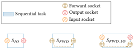
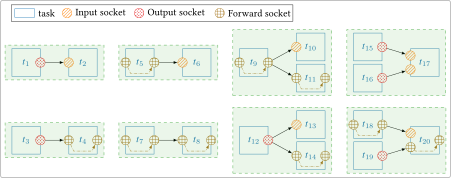

# Socket

Sockets are used to exchange data between [tasks](task.md). There are 3 
different types of sockets:

- Input socket (`socket_t::SIN`),
- Output socket (`socket_t::SOUT`),
- Forward socket (`socket_t::SFWD`): read and write data (see the [forward 
  socket](socket_fwd.md) section).

A task can have multiple sockets of different types (input, output and forward).
This is illustrated in the following figure:

<figure markdown>
  { width="600", align="left" }
  <figcaption>Tasks with different socket types.</figcaption>
</figure>

A socket is a C++ object of the `aff3ct::runtime::Socket` class. The following
sections try to give an overview of the most important attributes and methods
to facilitate the code understanding.


## Main Attributes

```cpp
socket_t type;
```
Define the socket type `IN`, `OUT` or `FWD`.

```cpp
std::string name;
```
Custom name for the socket.

```cpp
std::type_index datatype;
```
The type of data exchanged.

```cpp
void* dataptr;
```
Pointer to the data of the socket (memory space).

```cpp
std::vector<Socket*> bound_sockets;
```
The `input` or `forward` sockets bound to the current socket. Only relevant 
for `output` or `forward` sockets.

```cpp
Socket* bound_socket;
```
The unique `output` or `forward` socket bound to the current socket. Only
relevant for `input` or `forward` sockets.

## Main Methods

The most important methods of the socket class are `bind` and `unbind`.

```cpp
void bind(Socket &s_out, const int priority = -1);
```
This function is used to connect sockets with each other, it can be called by an
`input` or `forward` socket and takes as parameter an output or forward socket.
The function gets the caller's `dataptr` and redirects it to `s_out dataptr`.

Below some examples of valid and invalids socket bindings :

=== "Valid bindings"
    <figure markdown>
        { width=750, align="left" }
        <figcaption>Examples of **valid** socket bindings.</figcaption>
    </figure>

=== "Invalid bindings"
    <figure markdown>
        { width=487, align="left" }
        <figcaption>Examples of **invalid** socket bindings.</figcaption>
    </figure>

For invalid socket bindings, `AFF3CT-core` will throw an exception at runtime.

```cpp
void unbind(Socket &s_out, const int priority = -1);
```
This function is used to disconnect sockets from each other. 

!!! note
    `s_out` must be bound to the caller socket otherwise `AFF3CT-core` will
    throw an exception.

## Standard `SIN`/`SOUT` Sockets versus `SFWD` Socket

Using a couple of `SIN`/`SOUT` sockets or a single `SFWD` socket can have an 
impact on the code behavior and on the performance of the application. The most 
important point is the impact on the socket `dataptr` attribute.
 
- In the case of `SIN`/`SOUT` sockets, the input and the output sockets have 
  their own `dataptr`. The `input` socket receives the pointer from its bound 
  socket and the `output` socket has its own allocated memory space, the data 
  received and computed by the task are written to the `output` memory space. 
  The initial data are not modified in this case, there are no *side effects*.
- In the case of a single `SFWD` socket, the socket receives its `dataptr` from 
  the bound socket like an `input`. But unlike in the `SIN`/`SOUT` case, the 
  computed data are written directly on the provided memory space, thus 
  overwriting it (and potentially losing important information), there are 
  *side effects*.
