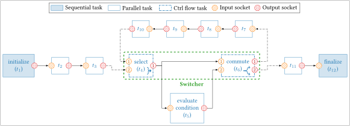
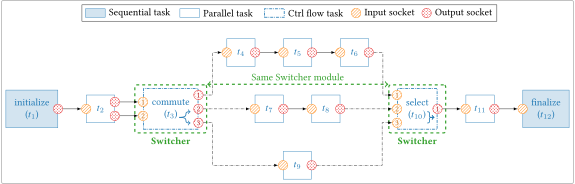

# Switcher

A **switcher** is a control flow [module](module.md) used to break sequences 
into *exclusive paths* through its two tasks: [`select`](#Select) and 
[`commute`](#Commute).  

A switcher is a C++ object of the `aff3ct::module::Switcher` class. The 
following sections try to give an overview of the most important attributes and 
methods to facilitate the code understanding.

## Main Attributes

<a name="Path"></a>
```cpp
size_t path;
```
The *exclusive path* to take when the `commute` task is reached. Read on the
[`ctrl socket`](#Commute) of `commute` task each time it is executed. The 
initial `path` value is set to `n_data_sockets - 1` prior to the first 
execution.

```cpp
const size_t n_data_sockets;
```
The number of data sockets for the `commute` and `select` tasks (not the total, 
but the *individual* number).

```cpp
const std::type_index datatype_commute;
const std::type_index datatype_select;
```
The type of data conveyed by the data sockets of each task.

```cpp
const size_t n_elmts_commute;
const size_t n_elmts_select;
```
The number of elements conveyed by each data sockets.
With `datatype` they define what and how much each data socket is expected to
read/write.

```cpp
const size_t n_bytes_commute;
const size_t n_bytes_select;
```
The product of the size  of `datatype` with `n_elemts` for the total number of
bytes expected on each data socket.

## Tasks

Since those tasks have a variable number of sockets they are accessed through
the subcript `operator[]` with a numerical index or a `std::string` unlike 
regular tasks which use namespaces and enumators.

<u>Examples:</u>

=== "Numerical indexes"

    ```cpp
    Switcher swi(2, 6, typeid(uint8_t)); // n_data_sockets, n_elemts, datatype

    swi[module::swi::tsk::select ][0]; // input  socket data0
    swi[module::swi::tsk::select ][1]; // input  socket data1
    swi[module::swi::tsk::select ][2]; // output socket data
    swi[module::swi::tsk::select ][3]; // output socket status

    swi[module::swi::tsk::commute][0]; // input  socket data
    swi[module::swi::tsk::commute][1]; // input  socket ctrl
    swi[module::swi::tsk::commute][2]; // output socket data0
    swi[module::swi::tsk::commute][3]; // output socket data1
    swi[module::swi::tsk::commute][4]; // output socket status
    ```

=== "`std::string`"

    ```cpp
    Switcher swi(2, 6, typeid(uint8_t)); // n_data_sockets, n_elemts, datatype

    swi[ "select::in_data0" ];         // input  socket data0
    swi[ "select::in_data1" ];         // input  socket data1
    swi[ "select::out_data" ];         // output socket data
    swi[ "select::status"   ];         // output socket status 

    swi["commute::in_data"  ];         // input  socket data
    swi["commute::in_ctrl"  ];         // input  socket ctrl
    swi["commute::out_data0"];         // output socket data0
    swi["commute::out_data1"];         // output socket data1
    swi["commute::status"   ];         // output socket status
    ```

<a name="Commute"></a>
### Commute

The **`commute` task** is used to **create exclusive paths**. When the `commute` 
task is executed it reads the [`path`](#Path) to take from its `ctrl` socket and 
then copies the bytes from its `data` input socket to the `data{path}` output 
socket. Then it sets the path attribute of the module to the one read.

Any task bound to its output sockets **before `status`** will be considered in a
diffferent *exclusive path*.
 
<u>Sockets</u>

| Type        | Name            | Index    |
| ----------- | --------------- | -------- |
| `Input`     | data            | 0        |
| `Input`     | ctrl            | 1        |
| `Output`    | data{0..N-1}    | {2..N+1} |
| `Output`    | status          | N+2      |

<a name="Select"></a>
### Select

The `select` task is ued to join exclusive paths.

When a `select` task is executed it gets the [`path`](#Path) from the module and
copies the bytes from its `data{path}` input to its `data` output socket. Any 
task bound to its input sockets will be considered in a different *exclusive
path*.

!!! danger
    Note that the execution will **fail** if the [`path`](#Path) it was executed
    from does not match the one in the module. That is most likely to happen in 
    a [loop](#Examples) because the `select` is executed before the `commute`. 
    Then the path defaults to `n_data_sockets - 1` meaning that in a loop, **the 
    first path taken before the first `select` execution should always be bound 
    to the last input socket**.

<u>Sockets</u>

| Type        | Name            | Index    |
| ----------- | --------------- | -------- |
| `Input`     | data{0..N-1}    | {0..N-1} |
| `output`    | data            | N        |
| `Output`    | status          | N+1      |

<a name="Examples"><a/>
## Examples

=== "While loop"
    <figure markdown>
      { width=1000 }
      <figcaption>Example of a sequence with a while-loop.</figcaption>
    </figure>

=== "Switch-case"
    <figure markdown>
      { width=1000 }
      <figcaption>Example of a sequence with a switch-case.</figcaption>
    </figure>