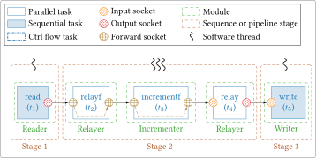

# Advanced

## Generic Pipeline

This program allows to build and to execute generic chains directly from the 
command line interface (CLI). Basically, there are 3 different types of task 
that can be instantiated:

- **First task**: To be correct, a chain should start with a task that have no 
  input socket. As a consequence, there is only one first task and it is 
  possible to choose between `read` and `initialize` tasks.
- **Middle task**: A task that have an input and an output socket. It is up to 
  the user to decide the number and the combination of middle tasks he wants. It 
  is possible to select between `relay`, `relayf`, `increment` and `incrementf` 
  tasks.
- **Last task**: To be correct, a chain should always end with a task that does 
  not have an output socket. As a consequence, there is only one last task and 
  it is possible to choose between `write` or `finalize` tasks.

Here is a summary of the available tasks and their behavior:

- `read`: Reads data from a binary file and writes the read bytes on its output 
  socket.
- `initialize` or `init`: Initializes the data in its output socket (useful for 
  benchmark and validation).
- `relay`: Copies the data from its input socket into its output socket.
- `relayf`: Variant of the `relay` task that uses 
  a [forward socket](socket_fwd.md), consequently, this task does NOTHING.
- `increment` or `incr`: Increments (+1) the data of its input socket and writes 
  the result in its output socket.
- `incrementf` or `incrf`: Variant of the `increment` task that uses 
  a [forward socket](socket_fwd.md) to write the result in place.
- `write`: Writes contents of its input socket into a binary file. It expects 0 
  or 1 values in its input socket to work correctly. 
- `finalize` or `fin`: Memorizes (= copies) the input data for further 
  validation (if there is a validation). 

There are two main ways of describing a processing chain:

1. **Specification of homogeneous types of task per stage.** This is performed 
   with the combination of the `-R` (or `--tsk-types-sta`) and `-n` 
   (or `--tsk-per-sta`) CLI parameters. `-R` gives the tasks type per stage 
   (example of a 4-stage pipeline: `-R (read,incr,relayf,write)`) and `-n` gives 
   how many tasks of the same type will be created per stage. For instance, the 
   combination of `-R (read,incr,relayf,write)` and `-n "1,2,3,1"` will produce 
   a 4-stage pipeline with the following sequence of tasks: `read` $\rightarrow$ 
   `incr` $\rightarrow$ `incr` $\rightarrow$ `relayf` $\rightarrow$ `relayf` 
   $\rightarrow$ `relayf` $\rightarrow$ `write`.

2. **Specification of heterogeneous types of task per stage.** This is achieved 
   with `-r` (or `--tsk-types`) CLI parameter. For instance, 
   `-r ((init),(incrf,relay,incr),(fin))` will produce a 3-stage pipeline with 
   the following sequence of tasks: `init` $\rightarrow$ `incrf` $\rightarrow$ 
   `relay` $\rightarrow$ `incr` $\rightarrow$ `fin`.

The first notation is a compressed way to describe chains of tasks. By default, 
the chain is split in [pipeline](pipeline.md) stages according to the given 
decomposition (with `-R` and `-r`) and each stage is run on a separated thread. 
It is also possible to run the chain in a [sequence](sequence.md) (with the `-q` 
or `--force-sequence` CLI parameter). In this case, the given stage 
decomposition is ignored and all the tasks of the chain are run by the same 
thread. 

!!! note
    You cannot use `-r` and `-R` parameters at the same time, they are 
    exclusive.

!!! note
    If `StreamPU` has been compiled with the CMake `-DSPU_LINK_HWLOC=ON` option,
    then it is possible to specify an [pinning policy](thread_pinning.md) with 
    the `-P` or `--pinning-policy` CLI argument.

!!! tip
    For the `increment`, `incrementf`, `relay` and `relayf` tasks it is possible
    to specify the duration. For instance, `relay_12` means that the `relay` 
    task will spend 12 microseconds in active waiting. This is different from
    using the `-s` CLI parameter. The `-s` parameter will set the same duration 
    for all the previously mentioned tasks.

Moreover, for each stage it is possible to specify the number of replications 
(= number of threads that will execute the stage) with the `-t` 
(or `--n-threads`) CLI parameter. Here are some examples of generated pipelines:

=== "3-stage pipeline with in/out sockets" 
    <figure markdown>
      { width="600" }
      <figcaption>`test-generic-pipeline`: input/output sockets & 3-stage pipeline.</figcaption>
    </figure>
    ```bash
    test-generic-pipeline -e 100 -n "1,3,1" -t "3,1,3" -R "(init,increment,fin)"
    ```

=== "3-stage pipeline with forward sockets"
    <figure markdown>
      { width="600" }
      <figcaption>`test-generic-pipeline`: forward sockets & 3-stage pipeline.</figcaption>
    </figure>
    ```bash
    test-generic-pipeline -i INPUT_FILE -n "1,3,1" -t "1,3,1" -R "(read,relayf,write)"
    ```

=== "3-stage pipeline with hybrid sockets"
    <figure markdown>
      { width="600" }
      <figcaption>`test-generic-pipeline`: hybrid in/out and forward sockets & 3-stage pipeline.</figcaption>
    </figure>
    ```bash
    test-generic-pipeline -i INPUT_FILE -t "1,3,1" -r "((read),(relayf,incrementf,relay),(write))"
    ```

=== "Complex 5-stage pipeline"
    <figure markdown>
      { width="1100" }
      <figcaption>`test-generic-pipeline`: hybrid in/out and forward sockets & 5-stage pipeline.</figcaption>
    </figure>
    ```bash
    test-generic-pipeline -e 100 -t "1,3,1,2,1" -r "((init,relayf,incr),(relayf,relay),(incrf),(relay),(relay,fin))"
    ```

------

**Command Line Arguments**

The following verbatim is a copy-paste from the `-h` stdout:

```bash
usage: ./bin/test-generic-pipeline [options]

  -t, --n-threads          Number of threads to run in parallel for each stage                   [empty]
  -f, --n-inter-frames     Number of frames to process in one task                               [1]
  -s, --sleep-time         Sleep time duration in one task (microseconds)                        [5]
  -d, --data-length        Size of data to process in one task (in bytes)                        [2048]
  -e, --n-exec             Number of executions (0 means -> never stop because of this counter)  [0]
  -u, --buffer-size        Size of the buffer between the different stages of the pipeline       [2048]
  -o, --dot-filepath       Path to dot output file                                               [empty]
  -i, --in-filepath        Path to the input file (used to generate bits of the chain)           [empty]
  -j, --out-filepath       Path to the output file (written at the end of the chain)             ["file.out"]
  -c, --copy-mode          Enable to copy data in sequence (performance will be reduced)         [false]
  -b, --step-by-step       Enable step-by-step sequence execution (performance will be reduced)  [false]
  -p, --print-stats        Enable to print per task statistics (performance will be reduced)     [false]
  -g, --debug              Enable task debug mode (print socket data)                            [false]
  -q, --force-sequence     Force sequence instead of pipeline                                    [false]
  -w, --active-waiting     Enable active waiting in the pipeline synchronizations                [false]
  -n, --tsk-per-sta        The number of tasks on each stage of the pipeline                     [empty]
  -r, --tsk-types          The socket type of each task (SFWD or SIO)                            [empty]
  -R, --tsk-types-sta      The socket type of tasks on each stage (SFWD or SIO)                  [empty]
  -P, --pinning-policy     Pinning policy for pipeline execution                                 [empty]
  -h, --help               This help                                                             [false]
```
