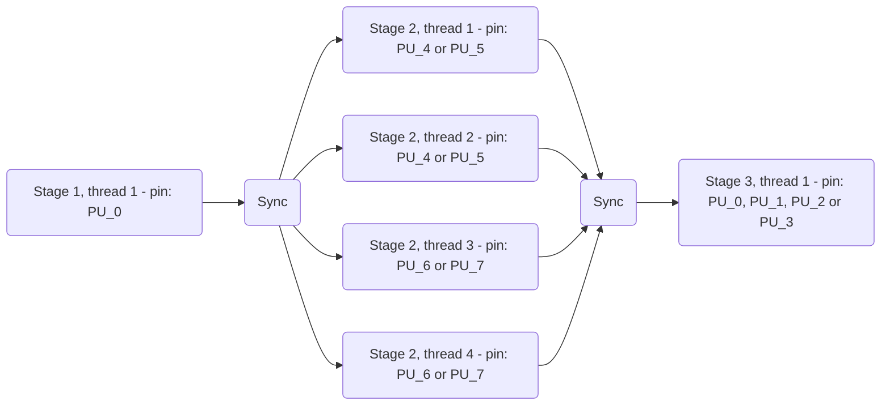
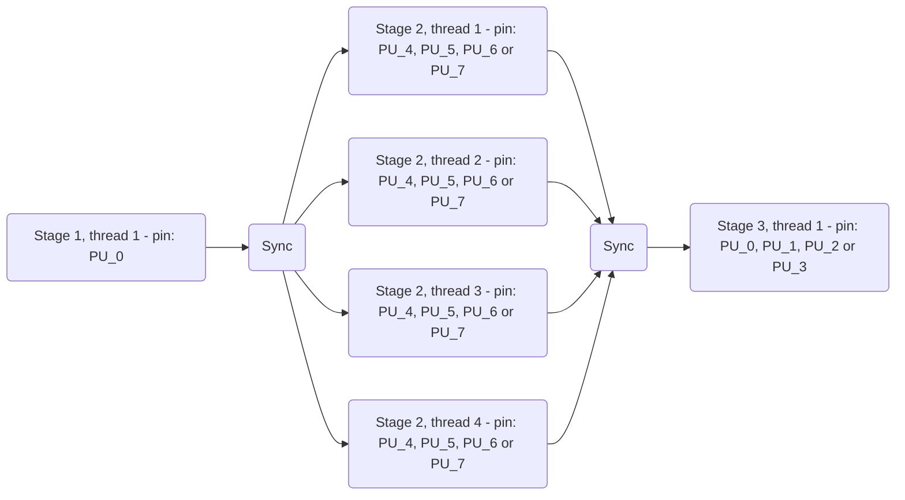

# Thread Pinning

`StreamPU` enables to select on which process units (PUs) the threads are 
effectively run. This is called *thread pinning* and it can significantly 
benefit to the performance, especially on modern heterogeneous architectures. 
To do so, the runtime relies on the 
[`hwloc`](https://www.open-mpi.org/projects/hwloc) library.

!!! warning
    To use thread pinning, `hwloc` library has to be installed on the system and
    `StreamPU` needs to be compiled with the `SPU_HWLOC` preprocessor 
    definition. It can simply be achieved using the following CMake option:
    ```bash
    cmake .. -DSPU_LINK_HWLOC=ON
    ``` 
    If `StreamPU` is not linked with the `hwloc` library, then the thread 
    pinning interface will have no effect and the threads will not be pinned.

!!! info
	Thread pinning relies the OS. The later needs to expose appropriated system 
	calls. While Linux and Windows provide these syscalls,	macOS does not... 
	Thus, **thread pinning will have no effect on macOS :-(**.

## Portable Hardware Locality

*Portable Hardware Locality* (`hwloc` in short) is a library which provides a 
**portable abstraction** of the **hierarchical topology of modern 
architectures** (see the figure below).

<figure markdown>
  
  <figcaption>
  	Result of the hwloc-ls command on the Orange Pi 5 Plus board (Rockchip 
  	RK3588 SoC, cores 0-3 are energy efficient ARM Cortex-A55 and cores 4-7 are 
  	powerful ARM Cortex-A76).
  </figcaption>
</figure>

`hwloc` gives the ability to pin threads over various level of hierarchy 
represented by a tree structure. The deepest/lowest nodes (the leaves) are the 
PUs while higher nodes represent sets of PUs that are physically close. For 
instance, a PUs set can share the same UMA node (in the case of a NUMA 
architecture), the same LLC or the same package. 

In the Orange Pi 5 SBC, if we pin a thread on the `Package L#0`, it will run 
over the following set of PUs: `PU L#0`, `PU L#1`, `PU L#2` and `PU L#3`. 
Thus, **the pinned thread can move in the selected `hwloc` node during the 
execution** and it is up to the OS to schedule the thread on the selected PUs 
set.

!!! warning
	The indexes given by `hwloc` can be different from those given by the OS: 
	they are logical indexes that express the real locality. **Consequently, in 
	`StreamPU`, it is important to use `hwloc` logical indexes.** The 
	`hwloc-ls` command gives an overview of the current topology with these 
	logical indexes.

## Sequence & Pipeline

In `StreamPU`, thread pinning can be set in `runtime::Sequence` and 
`runtime::Pipeline` class constructors. In both cases, there is a dedicated 
argument of `std::string` type named `sequence_pinning_policy` for 
`runtime::Sequence` or `pipeline_pinning_policy` for `runtime::Pipeline`.

!!! info
    For NUMA architectures, it is important to specify thread pinning at the 
    construction of the `runtime::Sequence`/`runtime::Pipeline` object to 
    guarantee that the data will be allocated and initialized on the right 
    memory banks (according to the first touch policy) during the replication 
    process.

To specify the pinning policy, we defined a syntax to express `hwloc` objects 
with three different separators:  

- Pipeline stage (does not concern `runtime::Sequence`): `|`
- Replicated stage (= replicated sequence = one thread): `;`  
- For one thread, the list of pinned `hwloc` objects (= logical or): `,`  

Then, the pinning policy can contains all the available `hwloc` objects. Below 
is the correspondence between the `std::string` and the `hwloc` object types:

```cpp
std::map<std::string, hwloc_obj_type_t> str_to_hwloc_obj =
{ 
  /* global containers */             /* data caches */              /* instruction caches */
  { "GROUP",   HWLOC_OBJ_GROUP    },  { "L5D", HWLOC_OBJ_L5CACHE },  { "L3I",  HWLOC_OBJ_L3ICACHE },
  { "NUMA",    HWLOC_OBJ_NUMANODE },  { "L4D", HWLOC_OBJ_L4CACHE },  { "L2I",  HWLOC_OBJ_L2ICACHE },
  { "PACKAGE", HWLOC_OBJ_PACKAGE  },  { "L3D", HWLOC_OBJ_L3CACHE },  { "L1I",  HWLOC_OBJ_L1ICACHE },
                                      { "L2D", HWLOC_OBJ_L2CACHE },  /* compute units */
                                      { "L1D", HWLOC_OBJ_L1CACHE },  { "CORE", HWLOC_OBJ_CORE     },
                                                                     { "PU",   HWLOC_OBJ_PU       },
};           
```

To specify the index `X` of an `hwloc` object, the following syntax is used: 
`OBJECT_X` (ex: `PU_5` refers to the logical PU n°5).

!!! info
    `CORE` and `PU` objects can be confusing. If the CPU cores do not support
    SMT, then `CORE` and `PU` are the same. However, if the CPU cores support
    SMT, then the `PU` is the hardware thread identifier inside a given `CORE`.

### Illustrative Examples

This section gives some examples to understand how the syntax works. We 
suppose that we have a CPU with 8 PUs with the same topology as the the Orange 
Pi 5 Plus SBC presented before.

#### Example 1

Let's suppose we want to setup a 3-stage pipeline with the following 
characteristics:

- **Stage 1** - No replication (= 1 thread): 
     - Pinned to `PU_0`
- **Stage 2** - 4 replications (= 4 threads): 
     - Thread n°1 is pinned to `PU_4` or `PU_5`
     - Thread n°2 is pinned to `PU_4` or `PU_5`
     - Thread n°3 is pinned to `PU_6` or `PU_7`
     - Thread n°4 is pinned to `PU_6` or `PU_7`
- **Stage 3** -  No replication (= 1 thread): 
     - Pinned to `PU_0`, `PU_1`, `PU_2` or `PU_3`



In the previous configuration, 6 threads will execute simultaneously (even if 
the given architecture supports up to 8 executions in parallel).

To instantiate this `runtime::Pipeline`, here are the corresponding constructor 
parameters:  

- Number of replications (= threads) per stage: `{ 1, 4, 1 }`
- Enabling pinning per stage: `{ true, true, true }`  
- Pinning policy: 
  `"PU_0 | PU_4, PU_5; PU_4, PU_5; PU_6, PU_7; PU_6, PU_7 | PU_0, PU_1, PU_2, PU_3"`

The previous pinning policy syntax can be compressed a little bit as follow:

- Pinning policy : 
  `"PU_0 | PACKAGE_1; PACKAGE_1; PACKAGE_2; PACKAGE_2 | PACKAGE_0"`

#### Example 2

Let's now consider that we want to pin all the threads of the stage 2 on the 
`PU_4`, `PU_5`, `PU_6` or `PU_7` (this is less restrictive than the previous 
example). The pinning strategy for stage 1 and 3 is unchanged.



Here are the corresponding parameters: 

- Number of replications (= threads) per stage: `{ 1, 4, 1 }`
- Enabling pinning per stage: `{ true, true, true }`  
- Pinning policy : `"PU_0 | PACKAGE_1, PACKAGE_2 | PACKAGE_0"`

With the previous syntax, the 4 threads of the stage 2 will apply the 
`PACKAGE_1, PACKAGE_2` policy.

#### Example 3

It is also possible to choose the stages we want to pin or not using a vector of 
`boolean`. Let's suppose we do not want to specify any pinning for the stage 1. 


Here are the corresponding parameters:

- Number of replications (= threads) per stage: `{ 1, 4, 1 }`
- Enabling pinning per stage: `{false, true, true}`  
- Pinning policy: `"| PACKAGE_1, PACKAGE_2 | PACKAGE_0"`

In this case, the OS will be in charge of pinning the thread of the first stage.
  
### Unpin

An **unpin** function exists and can be called by each thread individually. Once 
the `unpin` function is triggered the thread will be free to be scheduled by the 
OS over all the process units.

!!! warning
    We assume that the user is aware of the computer architecture, uses the 
    logical indexes of `hwloc` and follows the previously defined syntax rules, 
    otherwise the code will throw exceptions.
