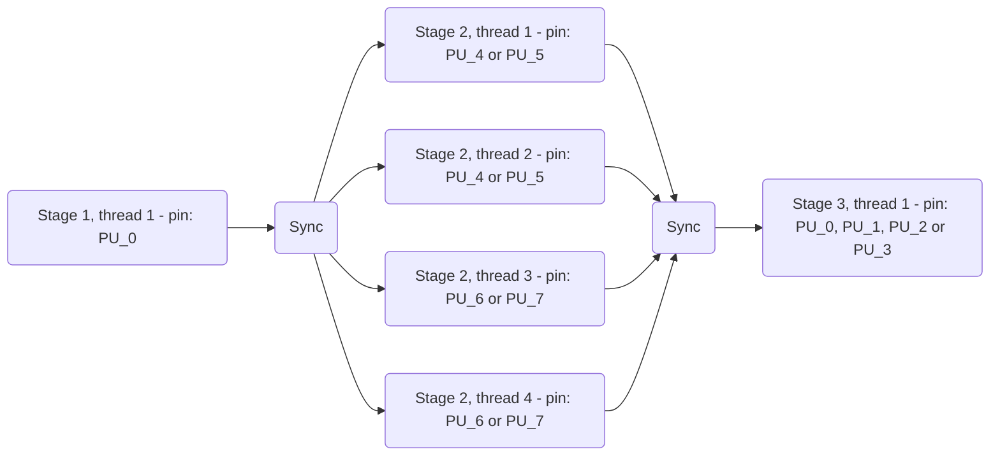
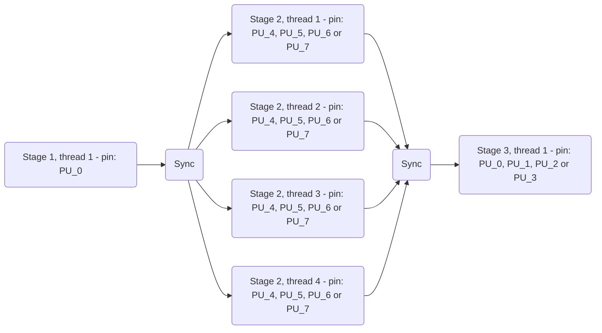
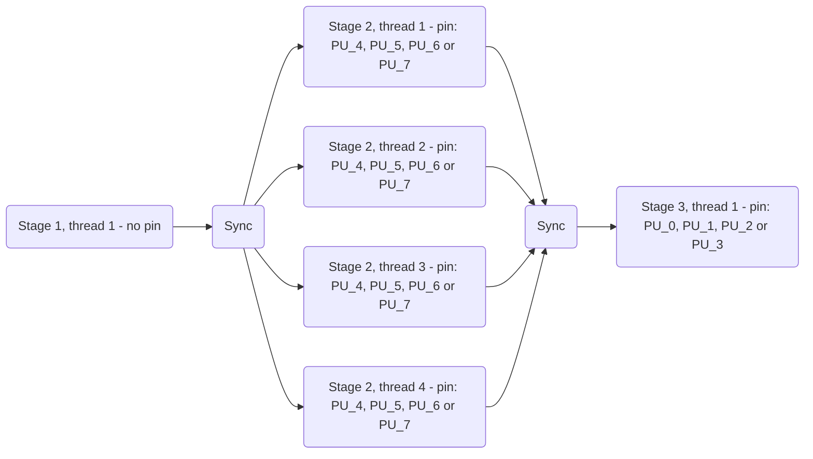

# Thread Pinning

`AFF3CT-core` enables to select on which CPU process units (PUs) the threads are 
effectively run. This is called *thread pinning* and it can significantly 
benefit to the performance, especially on modern heterogeneous architectures. 
To do so, the runtime relies on the 
[hwloc](https://www.open-mpi.org/projects/hwloc) library.

!!! warning
    To use thread pinning, hwloc libray has to be installed on the system and
    `AFF3CT-core` needs to be compiled with the `AFF3CT_CORE_HWLOC` preprocessor 
    definition. It can simply be achieved using the following CMake option:
    ```bash
    cmake .. -DAFF3CT_CORE_LINK_HWLOC=ON
    ``` 
    If `AFF3CT-core` is not linked with the hwloc library, then the thread 
    pinning interface will have no effect and the threads will not be pinned.

!!! info
	macOS operating system does not support the thread pinning feature.

## Portable Hardware Locality

*Portable Hardware Locality* (hwloc in short) is a library which provides a 
**portable abstraction** of the **hierarchical topology of modern 
architectures** (see the illustration below).

<figure markdown>
  { width=1000 }
  <figcaption>
  	Result of the hwloc-ls command on the Orange Pi 5 Plus board (Rockchip 
  	RK3588 SoC).
  </figcaption>
</figure>

Hwloc gives the ability to pin threads over any level of hierarchy with a tree 
view, where the process units are the leaves and there are intern nodes which 
represent a set of `PU` that are physically close (share the same LLC or are in 
the same NUMA node). 

For instance, we can choose to pin over a *Package* and the threads will run all 
over the process units that are within this level. In the Orange Pi 5 SBC, if we 
choose `PACKAGE_0` the threads will run over the following set of process units: 
`PU_0, PU_1, PU_3, PU_3`.

!!! warning
	The indexes given by hwloc are different from those given by the OS: they 
	are logical indexes that express the real locality. **Consequently, in 
	`AFF3CT-core`, it is important to use hwloc logical indexes.** The 
	`hwloc-ls` command gives an overview of the current topology with these 
	logical indexes.

## Sequence & Pipeline

In AFF3CT-core, the thread pinning can be set in `runtime::Sequence` and 
`runtime::Pipeline` classes constructor. In both cases, there is a dedicated 
argument of `std::string` type: `sequence_pinning_policy` for 
`runtime::Sequence` and `pipeline_pinning_policy` for `runtime::Pipeline`.

!!! info
    It is important to specify the thread pinning at the construction of these 
    objects to guarantee that the data will be allocated and initialized (first 
    touch policy) on the right memory banks during the replication process.

To specify the pinning policy, we defined a syntax to express hwloc with three 
different separators:  

- Pipeline stage (does not concern `runtime::Sequence`): `|`
- Replicated stage (= replicated sequence = one thread): `;`  
- For one thread, the list of pinned hwloc objects (= logical or): `,`  

Then, the pinning can contains all the available hwloc objects. Below is 
the correspondence between the `std::string` and the hwloc objects type 
enumerate:

```cpp
static std::map<std::string, hwloc_obj_type_t> object_map =
{ /* global containers */             /* data caches */              /* instruction caches */
  { "GROUP",   HWLOC_OBJ_GROUP    },  { "L5D", HWLOC_OBJ_L5CACHE },  { "L3I",  HWLOC_OBJ_L3ICACHE },
  { "NUMA",    HWLOC_OBJ_NUMANODE },  { "L4D", HWLOC_OBJ_L4CACHE },  { "L2I",  HWLOC_OBJ_L2ICACHE },
  { "PACKAGE", HWLOC_OBJ_PACKAGE  },  { "L3D", HWLOC_OBJ_L3CACHE },  { "L1I",  HWLOC_OBJ_L1ICACHE },
                                      { "L2D", HWLOC_OBJ_L2CACHE },  /* compute units */
                                      { "L1D", HWLOC_OBJ_L1CACHE },  { "CORE", HWLOC_OBJ_CORE     },
                                                                     { "PU",   HWLOC_OBJ_PU       },
};           
```

The following syntax is used to specify the object index `X`: `OBJECT_X`. 

`OBJECT` can be all the `std::string` defined in the previous listing 
(ex: `PU_10` refers to the logical process unit n°10).

!!! info
    `CORE` and `PU` objects can be confusing. If the CPU cores does not support
    SMT, then `CORE` and `PU` are the same. However, if the CPU cores support
    SMT, then the `PU` is the hardware thread identifier inside a given `CORE`.

### Illustrative Examples

The section proposes some examples to understand how the syntax works. Only the 
simplest hwloc object is used: the `PU`. Let's suppose that we have a octo-core 
CPU with 8 process units (`PU_0, PU_1, PU_2, PU_3, PU_4, PU_5, PU_6, PU_7`), see 
the topology of the Orange Pi 5 Plus above) and we want to describe a 3 stages 
pipeline with:

- **Stage 1** - No replication (= 1 thread): 
     - Pinned to `PU_0`
- **Stage 2** - 4 replications (= 4 threads): 
     - Thread n°1 is pinned to `PU_4` or `PU_5`
     - Thread n°2 is pinned to `PU_4` or `PU_5`
     - Thread n°3 is pinned to `PU_6` or `PU_7`
     - Thread n°4 is pinned to `PU_6` or `PU_7`
- **Stage 3** -  No replication (= 1 thread): 
     - Pinned to `PU_0`, `PU_1`, `PU_2` or `PU_3`



The input parameters will be:  

- Number of replications (= threads) per stage: `{ 1, 4, 1 }`
- Enabling pinning: `{ true, true, true }`  
- Pinning policy: 
  `"PU_0 | PU_4, PU_5; PU_4, PU_5; PU_6, PU_7; PU_6, PU_7 | PU_1, PU2"`

The syntax can also be compressed. For instance, for the previous example we 
could have used the following equivalent pinning syntax:

- Pinning policy : 
  `"PU_0 | PACKAGE_1; PACKAGE_1; PACKAGE_2; PACKAGE_2 | PACKAGE_0"`

Let's now consider that we want to pin all the threads of the stage 2 on the 
`PU_4`, `PU_5`, `PU_6` or `PU_7` (this is less restrictive than the previous 
example). The pinning strategy for stage 1 and 3 is the same as before.



- Pinning policy : `"PU_0 | PACKAGE_1, PACKAGE_2 | PACKAGE_0"`

With the previous syntax, the 4 threads of the stage 2 will apply the 
`PACKAGE_1, PACKAGE_2` policy.
  
It is also possible to choose the stages we want to pin using a vector of 
`boolean`. For instance, if we don't want to pin the first stage, we can do:  



- Enabling pinning: `{false, true, true}`  
- Pinning policy: `"| PACKAGE_1, PACKAGE_2 | PACKAGE_0"`

Thus, the operating system will be in charge of pinning the thread of the first
stage.
  
### Unpin

An **unpin** function exists and can be called by each thread individually. Once 
the `unpin` function is triggered the thread will be free to be scheduled by the 
OS over all the process units.

!!! warning
    We assume that the user is aware of the computer architecture, uses the 
    logical indexes of hwloc and follows the syntax rules, otherwise the code 
    will throw exceptions.
