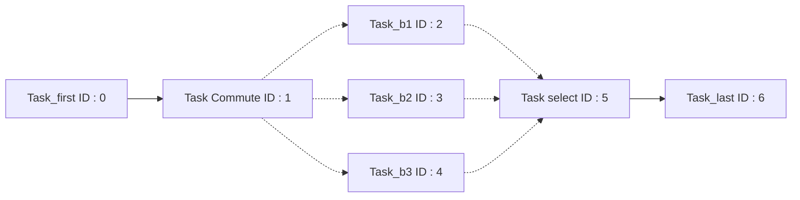
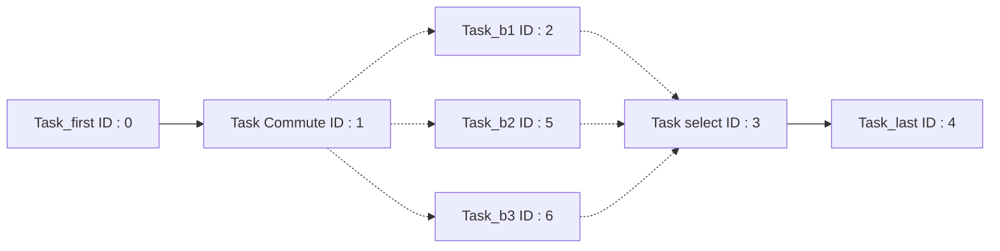
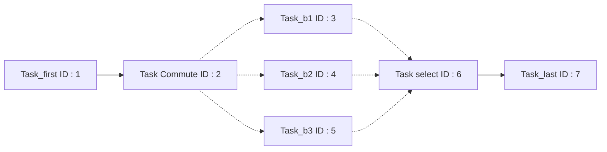
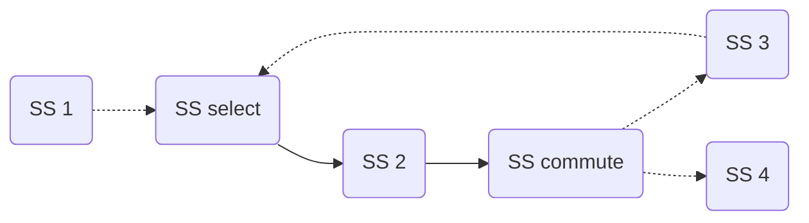

# Work in Progress

## Forward socket with control flow

Currently when `gen_processes` is called Select and Commute tasks do not behave
properly with `SFWD` tasks bound directly on their data sockets, indeed they
only rebind the first bound sockets while they should use `explore_thread_rec()`
to update the data pointers of every linked `SFWD`. As of now tasks bound to
switchers should be `SIO`.  

## Id updates

When push and pull tasks are inserted into the pipeline the function
`update_tasks_id()` is called to assert that the task IDs are still coherent,
the task with the greatest ID is used to insert the `push` task in stages for
instance. It uses the following algorithm.

```python
#It is called with min_id = 0 in the pipeline code, min_id is shared between recursive calls and NOT copied
#because it is a reference
void update_tasks_id(Node n, min_id):
    mark(n)
    for every task t in n:
        t.set_id(min_id)
        min_id += 1
    for every child c of n that is not marked:
        update_tasks_id(c, min_id)
```

This however can lead to issues. For instance when updating the IDs of a
sequence with a switch-case.

***This is a graph of TASKS, not SUBSEQUENCES***



Here is the result of the DFS-id update.



This is not a coherent set of IDs, `Task_last` should not have an ID inferior
than `Task_b2` and `Task_b3`, but due to the nature of the DFS algorithm it was
assigned a lesser id because it was reached first, thus `Task_b2` was updated
later and given a greater id.

The current implementation uses the following algorithm.

```python
#We no longer have a minimum, instead we simply increment each ID by 1
void update_tasks_id(Node n):
    mark(n)
    for every task t in n:
        t.set_id(t.id + 1)
    for every child c of n that is not marked:
        update_tasks_id(c)
```

Which results in



While this is a coherent set of IDs, we lost control over the `min_id`, which is
less-than-ideal and thus every task has a new ID while they didn't need change.
A better long term solution would perhaps be to use the `min_id` system in order
to keep the old numerical values of already existing tasks but this time with a
breadth-first type algorithm.

## End-of-sequence commutes

Currently a sequence may not end with a switcher task, this is problematic for
pipelines as this means that individual stages cannot have a commute as their
last task. This would require modifications to the `last_subsequence()`
function, as an end-of-sequence commute would still have a children.

### Example

As an example, let's try to divide the following sequence into 3 stages



=== "Stage 1"
    ```mermaid
    graph LR;
    A(SS1);
    ```
=== "Stage 2"
    ```mermaid
    graph LR;
    B(SS select)-->C(SS 2);
    C(SS 2)-->F(SS commute);
    F(SS commute)-.->E(SS 3);
    E(SS 3)-.->B(SS select);
    ```
=== "Stage 3" 
    ```mermaid
    graph LR;
    G(SS 4);
    ```!

With our current implementation of the DFS, Stage 2 technically has no final
subsequence as every single node has atleast one child thus making the insertion
of push tasks impossible. A solution would be to introduce a fake task after
each commute on their last path during pipeline creations.
